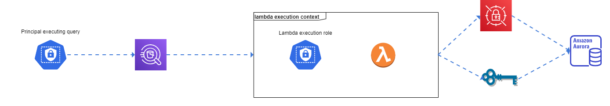

# Amazon Athena Lambda Jdbc Connector, with ABAC security based on calling principal

This is a demo-project demonstrating the ability to authorize towards JDBC sources using principal tags associated with the Athena caller. Original repo: https://github.com/awslabs/aws-athena-query-federation/tree/master/athena-jdbc

**The standard Athena connector security flow

**Security flow based on principal tags

